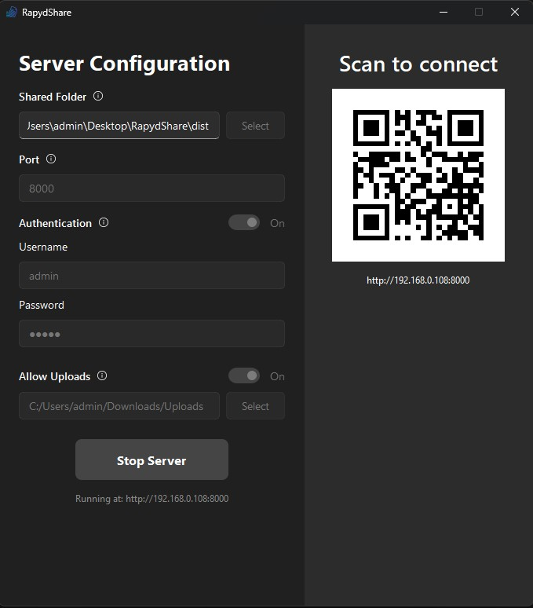

# RapydShare ⚡

A modern, fast, and secure local file transfer tool.



## 🚀 Features

- **Fast Transfer:** Utilizes the full bandwidth of your local network.
- **Modern UI:** Clean, responsive Windows 11 style interface (PyQt6 + Fluent Widgets).
- **Web Client:** Responsive React + TypeScript web interface for mobile and desktop clients.
- **Rich Previews:** Built-in image, video, and PDF previews.
- **Security:** Optional authentication (Username/Password) to restrict access.
- **Cross-Platform Core:** Powered by Python (FastAPI) and React.

## 🛠️ Tech Stack

- **Backend:** Python, FastAPI, Uvicorn
- **Frontend:** React, TypeScript, Tailwind CSS, Vite
- **Desktop GUI:** PyQt6, QFluentWidgets
- **Build Tool:** PyInstaller

## 📦 Installation & Usage (For Users)

1. Download the latest `RapydShare.exe` from the [Releases Page](https://github.com/Overresurrect/RapydShare/releases).
2. Run the application.
3. Select a folder to share and click **Start Server**.
4. Scan the QR code or enter the URL on your other device to start downloading.

## 💻 Development Setup (For Contributors)

### Prerequisites
- Python 3.10+
- Node.js & npm

### 1. Clone the repository
```bash
git clone https://github.com/YOUR_USERNAME/RapydShare.git
cd RapydShare
```

### Backend Setup
```bash
# Install dependencies
pip install -r requirements.txt
```

### Frontend Setup
```bash
cd frontend
npm install
# Start React dev server
npm run dev
```

### Running the App
```bash
python main.py
```

### Building the Executable
```bash
# First build the React frontend
cd frontend
npm run build
cd ..
```

# Run the build script
```bash
python build.py
```
