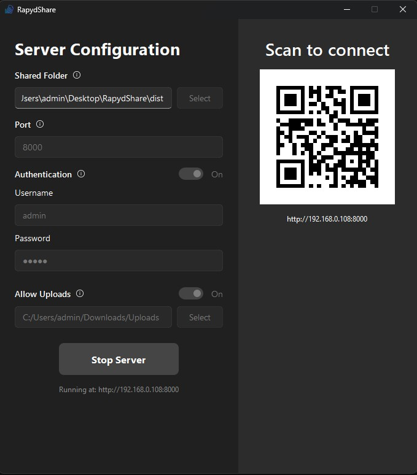
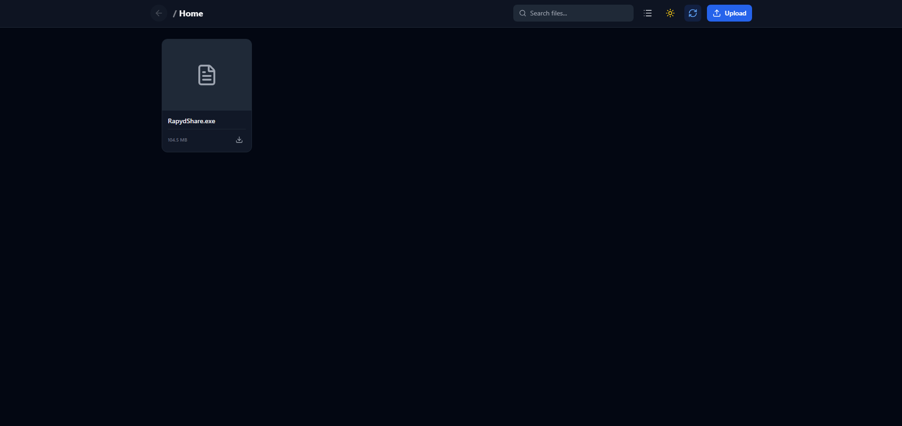

# RapydShare ⚡

A modern, fast, and secure local file transfer tool.


*RapydShare.exe*


*RapydShare Web Client*

## 🚀 Features

- **Fast Transfer:** Utilizes the full bandwidth of your local network.
- **Two-Way Sharing:** Download files from the host *and* upload files back to it — with drag-and-drop, multi-file progress, and an opt-in host toggle.
- **Modern UI:** Clean, responsive Windows 11 style interface (PyQt6 + Fluent Widgets).
- **Web Client:** Responsive React + TypeScript web interface for mobile and desktop clients.
- **Rich Previews:** Built-in image, video, and PDF previews.
- **Security:** Optional authentication (Username/Password) to restrict access.
- **Cross-Platform Core:** Powered by Python (FastAPI) and React.

## 🛠️ Tech Stack

- **Backend:** Python, FastAPI, Uvicorn
- **Frontend:** React, TypeScript, Tailwind CSS, Vite
- **Desktop GUI:** PyQt6, QFluentWidgets
- **Build Tool:** PyInstaller

## 📦 Installation & Usage (For Users)

1. Download the latest `RapydShare.exe` from the [Releases Page](https://github.com/Overresurrect/RapydShare/releases).
2. Run the application.
3. Select a folder to share and click **Start Server**.
4. (Optional) Flip on **Allow Uploads** and pick an upload folder if you want clients to be able to send files to you.
5. Open the URL shown in the tool on your client device (iPhone, Android, laptop, etc.), including the port number — or scan the QR code.

## 💻 Development Setup (For Contributors)

### Prerequisites

- Python 3.10+
- Node.js & npm

### 1. Clone the Repository

```bash
git clone https://github.com/Overresurrect/RapydShare.git
cd RapydShare
```

### 2. Backend Setup

```bash
pip install -r requirements.txt
```

### 3. Frontend Setup

```bash
cd frontend
npm install
```

### 4. Running the App

The desktop app serves the built React frontend, so build it once before running:

```bash
cd frontend
npm run build
cd ..
python main.py
```

For active frontend development, you can run the Vite dev server in parallel:

```bash
cd frontend
npm run dev
```

### 5. Building the Executable

```bash
# Build the React frontend first
cd frontend
npm run build
cd ..

# Then run the PyInstaller build script
python build.py
```

The resulting `RapydShare.exe` will be in the `dist/` folder.

## 📄 License

See [LICENSE](LICENSE) for details.
